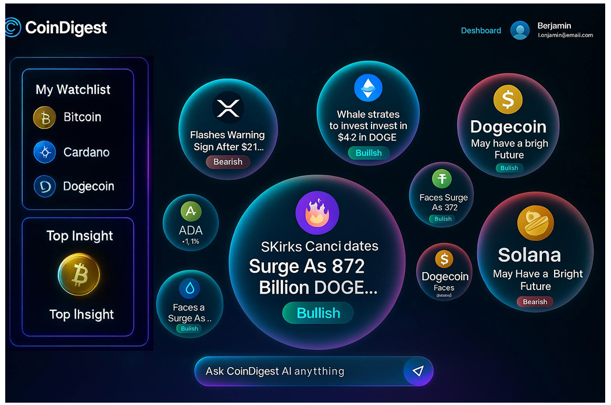
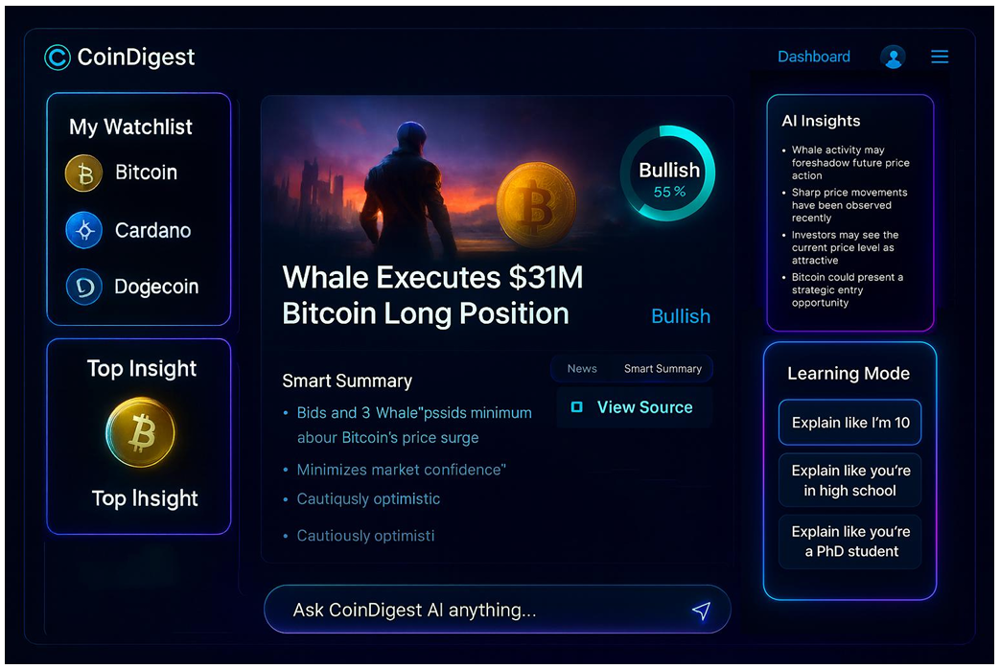
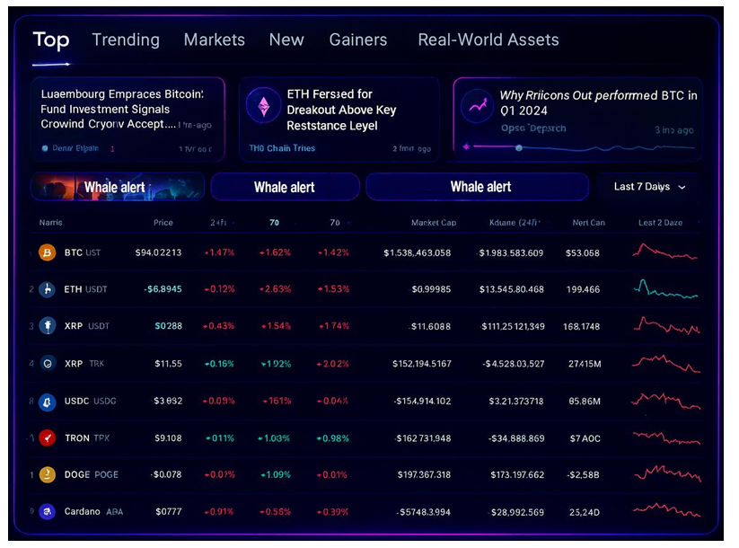
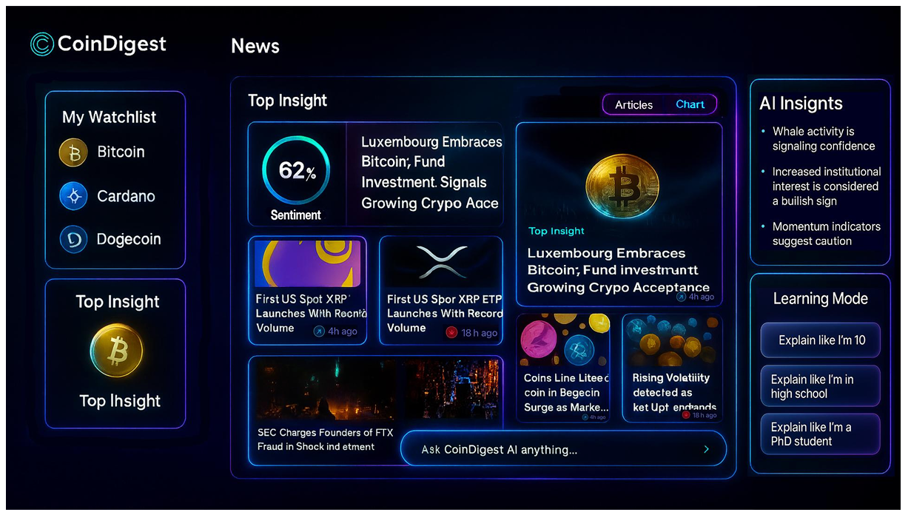
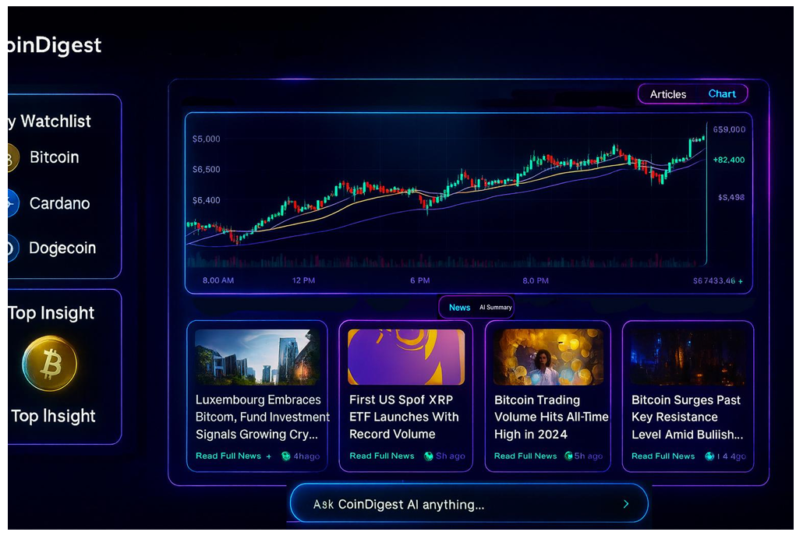
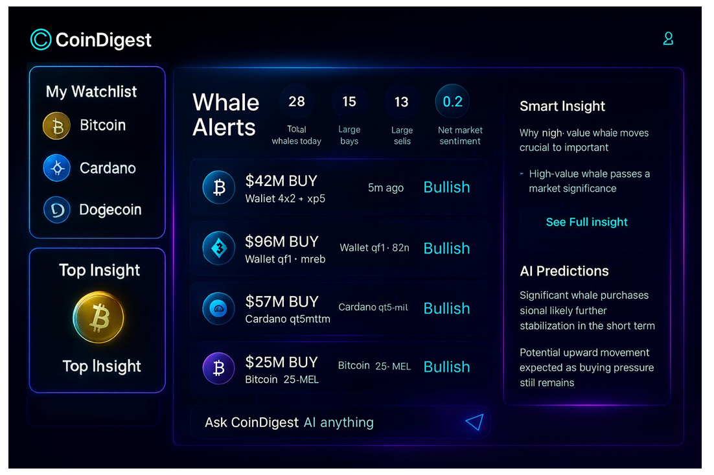

# 🏠 Main Site

## 📊 CoinDigest Logged In Dashboard

### 🎨 Theme

- 🌑 Deep navy black background
- 🔮 Frosted glass panels with strong blur
- 💫 Clear neon borders in cyan and purple
- 💎 Aqua highlights
- ⚪ White text only
- 🟢 No green anywhere except for bullish sentiment
- 🔴 Red only for bearish sentiment or negative percent changes

### 📍 Main Heading Panel (Top Center)

**Headline:**
> 💡 Your Daily Crypto Intelligence

**Subtext:**
> ⚡ Real time AI insights across your coins news sentiment and whale activity

**Panel style:**
- 🔮 Frosted glass
- 💫 Cyan and purple neon rim
- ✨ Strong premium Web3 look

### 📋 Left Sidebar Watchlist

**Title:** 📌 Watchlist

Each coin shows:
- 🪙 Official coin icon colour
- 📛 Coin name
- 💰 Current price
- 📈 24h change percentage in cyan for up or red for down

**Coins shown:**
₿ Bitcoin, Ξ Ethereum, ◎ Solana, 💧 XRP, 🐕 Dogecoin

The panel must use a strong neon cyan and purple border.

### 🔄 Left Sidebar Rotating Top Insight Panel

This panel rotates automatically every 5 seconds.

**It rotates between:**
1. 💡 Top Insight of the Day
2. 📰 Trending Headlines
3. 📊 Trending Coins
4. 📈 Sentiment Overview
5. 🤖 AI Insights
6. 🐋 Whale Alerts
7. 💰 Current Price of User Tracked Coins

**Rotation rules:**
- Smooth fade transition
- Soft neon flash when switching
- No jitter or duplication

### Top Insight of the Day (Content inside rotation)

Shows the strongest AI detected signal of the day.

**Includes:**
- Coin icon
- Coin name
- One sentence AI summary

**Example:**
> XRP shows rapid gains in trading

### 📊 Sentiment Overview Panel

**Title:** 📈 Sentiment Overview

**Show:**
- ⭕ Circular sentiment ring
- 🟢 Green for bullish
- 🔴 Red for bearish
- 🔢 Large percentage in the center
- 🏷️ Label Bullish or Bearish
- 📝 Text: Market sentiment is showing increasing momentum in the selected assets
- 📉 Thin 24h sentiment trend bar

Directly below Sentiment Overview: New Whale Alert section

### 🐋 Whale Alert Panel (New Addition)

This block sits directly under the Sentiment Overview.

**Show:**
- 🏷️ Title: Whale Alert
- 📢 Short one sentence alert

**Example text:**
> 🐋 Strong whale accumulation detected on XRP

or

> 💰 Large whale executed fourteen point two million dollar buy order in Bitcoin within the last hour

**Panel style:**
- Frosted glass
- Neon glow border
- Text must be simple and easy to read for all users

### 📰 Trending Headlines Panel

**Title:** 🔥 Trending Headlines

Each card shows:
- 🖼️ Thumbnail image
- 📰 News headline
- 📝 Short summary
- ⏰ Time posted
- 🏷️ Sentiment tag in cyan or purple
- 🔗 Read Full News link

Panel must look premium with a Bloomberg style feel but Web3 lighting.

### 📊 Trending Coins Panel

**Title:** 🔥 Trending Coins

**Toggle buttons at top:**
- 📅 24h Gain
- ⏰ 1h Gain

**Each coin shows:**
- 🪙 Official coin icon colour
- 📛 Coin name
- 📈 Percent change cyan for up red for down
- 📉 Micro sparkline chart

**Coins:**
₿ BTC, Ξ ETH, ◎ SOL, 🐕 DOGE, 🔗 LINK, ₳ ADA, ⚫ DOT

### 🤖 Right Panel AI Insights

**Title:** 🧠 AI Insights

**Show 3 to 4 short insights:**
- ⚠️ Rising volatility detected on XRP
- 🐋 Large whale accumulation detected on ETH
- 📉 Bitcoin sentiment decreased over the past 3 hours

Bullets must use cyan or purple.

### 💬 Bottom AI Chat Bar

A full width frosted glass bar.

**Text inside:**
> 💬 Ask CoinDigest AI anything

**Right side:**
💫 Neon cyan send icon

The bar must glow strongly and look premium.

### Animations (Page Load and Hover)

**Global Panel Animation (On Load):**
- Fade in from zero to one hundred percent
- Move upward ten to twenty pixels
- Neon border lights animate cyan to aqua to purple
- Stagger delay zero point zero five seconds

**Panel Hover Effect:**
- Glow increases
- Border brightens
- Slight scale up to one point zero three
- Smooth and clean movement

**Watchlist Hover:**
- Coin icon pulses cyan
- Glass brightens

**Sentiment Overview Animation:**
- **On load:** Sentiment ring animates from zero percent to target percent
- **On hover:** Ring glows green for bullish or red for bearish, percentage pulses gently

**Whale Alert Animation:**
- **On load:** Text fades in with a soft cyan flash
- **On hover:** Text glows aqua

**Trending Headlines Animation:**
- **On load:** Cards slide up slightly, thumbnails zoom two percent
- **On hover:** Thumbnail brightens, headline text glows cyan

**Trending Coins Animation:**
- **On load:** Percentages count up from zero to final value, sparklines animate left to right
- **On hover:** Sparkline glows cyan, icon brightens

**AI Insights Panel Animation:**
- **On load:** Insights appear one at a time with a cyan flash
- **On hover:** Selected insight glows aqua

**Bottom Chat Bar Animation:**
- **On load:** Bar slides up and glows
- **On focus:** Glow intensifies
- **On hover:** Send icon pulses softly

### Developer Notes

- All panels must use strong neon borders in cyan and purple
- No duplicated elements anywhere
- No faint outlines
- Layout must stay fully horizontal and desktop first
- Colour palette must follow the CoinDigest brand exactly
- Rotating panel must switch smoothly with no issues

---

## 📰 CoinDigest News Page

### Theme

- Deep navy black background
- Frosted glass panels with blur
- Neon cyan and purple glow borders
- Aqua highlights
- White text
- No green anywhere unless used for bullish sentiment
- Red only for bearish sentiment or negative price changes

### Page Title Section

**Title:** News

**Position:** Top center

### Left Sidebar

**A. Watchlist**

**Title:** My Watchlist

**Coins displayed:**
- Bitcoin
- Cardano
- Dogecoin

**Each item includes:**
- Official coin icon with correct colours
- Coin name
- Frosted glass background
- Neon cyan border glow
- Clean spacing

A button named **Manage** is placed under the list.

**B. Top Insight (Left Column)**

**Title:** Top Insight

Shows the number one AI detected insight of the day.

**Inside the card:**
- Correct coin icon colour
- Label: Top Insight
- One sentence AI summary

**This card rotates between:**
- Top Insight of the Day
- Sentiment Overview
- Trending Coins
- Trending Headlines

The transition uses smooth fade animations.

### Main News Section (Center)

**A. Top Insight Row**

**Left side:**
- Sentiment ring
- Sentiment percent in green for bullish or red for bearish
- Label: Top Insight

**Right side:**
AI generated title and summary

**Example text:**
> Luxembourg Embraces Bitcoin Fund Investment Signals Growing Crypto Acceptance

**Card style:**
- Frosted glass
- Neon cyan and purple glow border

### News Grid (Center and Right)

Each news card includes:
- Thumbnail image
- Headline
- Short summary (one to two sentences)
- Time posted
- Cyan link: Read Full News
- Frosted glass with neon border
- Clear spacing for easy reading
- Sentiment icon in the bottom right corner
  - Green icon for bullish sentiment
  - Red icon for bearish sentiment

These icons help users see if the news is positive or negative.

**Example headlines:**
- First US Spot XRP ETF Launches With Record Volume
- SEC Charges Founders of FTX Fraud in Shock Indictment
- Coins Like Litecoin and Dogecoin Surge as Market Uptrends

### Featured Article (Right Column)

This card is the largest and most important article on the page.

**It includes:**
- Large thumbnail
- Label: Top Insight
- Bold headline
- Summary text
- Neon border with cyan and purple glow
- Sentiment icon in the bottom right corner of the card

This section highlights the main story of the day.

### Bottom Chat Bar

Full width frosted glass bar.

**Text inside:**
> Ask CoinDigest AI anything

**Right side:**
Neon cyan arrow button

The bar must have a soft glow.

### Design Rules

- Do not use green unless for sentiment rings or bullish icons
- Use neon cyan and purple glow borders on all panels
- All panels must use a frosted glass style
- Coin icons must use official colours
- Use a balanced horizontal layout for desktop
- No duplicate cards
- Keep the screen clean simple and premium

### SEO Optimized Text to Use

Use these exact lines:
- News
- My Watchlist
- Top Insight
- Read Full News
- Ask CoinDigest AI anything
- Luxembourg Embraces Bitcoin Fund Investment Signals Growing Crypto Acceptance
- First US Spot XRP ETF Launches With Record Volume
- SEC Charges Founders of FTX Fraud in Shock Indictment

### Animations (Load and Hover)

**Page Load Animations:**
- All panels fade in from zero to one hundred percent
- Slight upward motion ten to twenty pixels
- Duration zero point three five seconds
- Stagger delay zero point zero five seconds
- Borders animate from cyan to aqua to purple

**Hover Effects:**
- Glow becomes brighter
- Border becomes brighter
- Small scale increase to one point zero three
- Thumbnail brightens
- Headline glows in cyan

**Sentiment Ring Animation:**
- Animates from zero percent to the final percent
- Smooth sweep arc in zero point eight seconds
- Hover glow uses green for bullish or red for bearish

**Trending Coins Animation:**
- Percentage counts up from zero
- Sparklines animate from left to right
- Coin icon becomes brighter on hover

**AI Insights Animation:**
- Bullets appear one by one
- Hover highlights the selected line in aqua

**Top Insight Rotating Card:**
- Cycles through Top Insight, Sentiment Overview, Trending Coins and Trending Headlines
- Uses smooth fade animations

**Bottom Chat Bar Animation:**
- Slides up on page load
- Glow increases when focused
- Cyan pulse when hovered

### Developer Notes

- Use the same neon glow borders on every glass panel
- Keep layout horizontal for desktop
- Follow the CoinDigest colour palette exactly
- Do not duplicate any card
- Keep spacing clean clear and even
- Every news card must include the new bottom right sentiment icon

---

## 🫧 CoinDigest "Bubbles Mode" News Dashboard

### Theme

- Deep navy black background
- Frosted glass bubbles and panels
- Neon cyan + purple glow borders
- Aqua highlight tones
- White text for all typography
- Green only for bullish sentiment
- Red only for bearish sentiment

### Page Overview

This screen is the "Bubbles Mode" version of the CoinDigest News page.

Users must be able to switch between:
1. Standard News View (normal news cards)
2. Bubbles Mode (floating bubble layout)

**Toggle button text:**
- News View
- Bubbles Mode

### Left Sidebar

**A. Watchlist**

**Title:** My Watchlist

**Coins shown:**
- Bitcoin
- Cardano
- Dogecoin

**Each item must use:**
- Correct official coin icon colours
- Frosted-glass background
- Cyan + purple neon glass border

**B. Top Insight (Left Column)**

**Title:** Top Insight

This shows the strongest AI-detected insight of the day.

**Content includes:**
- Coin icon
- Coin name
- 1-sentence AI summary

### Main Bubble Area (Center)

This section displays crypto news stories inside floating glass bubbles.

**Each bubble must include:**
- Coin icon (correct colours)
- News headline in 1–2 short lines
- Sentiment label:
  - Bullish (green)
  - Bearish (red)
- Smooth frosted-glass bubble style
- Neon glow around the edges

**Bubbles must vary in size depending on:**
- Importance of the news
- Strength of sentiment
- Volume or engagement level

### Bubble Animation Rules

**A. On Page Load:**
- All bubbles rise upward slightly (5–15px)
- Fade in from 0% to 100% opacity
- Neon border lights up cyan → aqua → purple
- Large bubbles appear first, then medium, then small (staggered load)

**B. Constant Float Motion:**
- Bubbles gently move around the screen
- Slow floating drift in random directions
- Soft bouncing when bubbles touch each other
- Movement must feel smooth, premium, futuristic
- No sharp or fast movements

**C. Hover Effects:**
- Bubble glows brighter (cyan/purple)
- Slight scale-up (1.04x)
- Headline text becomes sharper
- Sentiment tag glows green or red

**D. Click Action:**
When user clicks a bubble:
- Bubble expands slightly
- Opens full article in a separate panel or modal

### Center "Top Story" Bubble

The largest bubble in the center must show the main trending story.

**Content inside:**
- Large coin icon / category icon
- Short headline (up to 3 lines)
- Sentiment tag (Bullish or Bearish)
- Frosted glow stronger than other bubbles
- Must be visually dominant

### Other Bubbles (Medium + Small)

Examples of items to display:
- Short headline
- Sentiment
- Coin icon (if applicable)
- Optional mini % (e.g., "ADA -1.1%")

### Bottom AI Chat Bar

A full-width glowing bar at bottom.

**Text inside:**
> Ask CoinDigest AI anything

**Right side:**
- Neon cyan arrow send button

**Animations:**
- Slide-up on page load
- Glow intensifies when focused

### SEO Text to Use

Use these exact lines for SEO:
- My Watchlist
- Top Insight
- Ask CoinDigest AI anything
- Surge As 872 Billion DOGE Moves
- Flashes Warning Sign After $21M Movement
- Whale Strategies To Invest in DOGE
- Solana May Have a Bright Future
- Rising Volatility Detected as Market Uptrends
- ADA Drops as Sentiment Weakens

### Developer Notes

- Keep layout clean and wide for desktop
- Bubbles must never overlap text or sidebar
- All coin icons MUST use official colours
- No green anywhere unless sentiment = bullish
- Use consistent neon glow intensity (cyan + purple)
- Keep spacing even and balanced
- Movement must be subtle and premium, never cartoony

---

## 📄 CoinDigest Article View Page

### Theme

- Deep navy black background
- Frosted glass panels with blur effect
- Strong neon borders in cyan + purple
- Aqua highlights
- White text only
- No green anywhere except for bullish sentiment ring
- Red only for bearish sentiment
- All elements must look premium, glassmorphic, and Web3

### Top Navigation Bar

- CoinDigest logo on left
- "Dashboard / News / Bubbles" navigation
- Toggle option on top-right to switch between:
  - News Mode
  - Bubbles Mode
- User profile icon on right

### Left Sidebar — Watchlist

**Title:** My Watchlist

**Each item shows:**
- Coin icon with official color
- Coin name
- Price + % change (cyan = up, red = down)

**Must use:**
- Clear neon cyan + purple border
- Strong glass blur
- Smooth glow on hover

**Coins displayed:**
Bitcoin, Cardano, Dogecoin

(Devs will replace with user-selected coins later)

### Left Sidebar — Top Insight

**Title:** Top Insight

**Shows:**
- Coin icon
- Insight type (Top Insight)
- One short AI-generated insight

**Panel must be animated:**
- Soft rotating glow
- Panel pulses gently every 10 seconds
- Highlights when clicked

### Main Article Panel (Center)

This is the primary article section the user opens.

**Must display:**

1. **Article Image** (top, full-width inside the card)

2. **Sentiment Ring** (right side)
   - Green = Bullish
   - Red = Bearish
   - Large percentage inside ring
   - Glow animation on load

3. **Article Title** (large white text)

4. **Sentiment Label** (Bullish or Bearish)

5. **Smart Summary Section:**
   - Short bullet points
   - Each bullet uses aqua text
   - High readability

6. **Toggle Buttons:**
   - "News"
   - "Smart Summary"
   
   These toggle between:
   - The full article text
   - The simplified smart summary
   
   Must animate with:
   - Soft neon glow
   - Smooth sliding state change

7. **"View Source" Button:**
   - Takes user to original article URL
   - Cyan glowing border
   - Node icon included
   - Strong hover glow

### Right Sidebar — AI Insights

**Title:** AI Insights

**Content:**
- 4–5 short AI-generated insights related to the article
- Focus on:
  - Whale activity
  - Market sentiment
  - Price movement
  - Entry opportunities
  - Risk signals

Bullets must use cyan or purple glow.

**Panel must have:**
- Clear neon purple + cyan border
- Strong glass blur
- Premium shine

### Right Sidebar — Learning Mode

**Title:** Learning Mode

**3 Glassmorphic Buttons:**
- Explain like I'm 10
- Explain like you're in high school
- Explain like you're a PhD student

**Button style:**
- Thick neon borders
- Deep frosted glass background
- Slight scale-up on hover
- Cyan glow ripple effect on click

These buttons instantly rewrite the article into the selected comprehension level.

### Bottom Chat Input Bar

Full-width glowing bar:

**Text:**
> Ask CoinDigest AI anything…

**Right side:**
- Neon cyan send icon
- Strong glowing trail animation

Chat bar must glow more intensely when user activates text input.

### Mode Toggle — News Mode / Bubbles Mode

Users must be able to switch between two formats:

1. **News Mode**
   (The article layout shown above)

2. **Bubbles Mode**
   - Circular floating bubbles
   - Each bubble represents a news event
   - Sentiment color inside (green = bullish, red = bearish)
   - Bubbles gently bounce and move around
   - Clicking a bubble opens the article panel
   - Must feel alive and futuristic

### Animations (All Panels)

**Page Load (All Panels):**
- Fade in from 0% → 100%
- Float upward ~12px
- Neon border lights animate cyan → aqua → purple
- Delay 0.05s between panels for staggered effect

**Hover Effects:**
- Strong neon glow increase
- Borders brighten
- Slight 1.03x scale
- Smooth 0.18s transition

**Sentiment Ring Animation:**
- Ring sweeps from 0% to actual value
- Glow pulses every 5 seconds

**Learning Mode Buttons:**
- Ripple glow effect on hover
- Button brightens sharply on click

**AI Insights Panel:**
- Insights appear one by one (50ms delay)
- Aqua flash highlight on hover

**Chat Bar Animation:**
- Slide up and glow on load
- Cyan pulse on hover
- Bright highlight when typing

### Developer Notes

- No repeated components
- No faint borders
- Must match the exact neon/glass style
- Entire layout must be horizontal for desktop
- All colors follow CoinDigest brand
- Article panel must never duplicate text
- Keep spacing consistent across all panels

---

## 📊 CoinDigest Markets Screen

### Theme

- Deep navy black background
- Frosted glass panels with blur
- Clear neon borders in cyan and purple
- Aqua highlights
- White text only
- No green anywhere except for bullish percent
- Red only for bearish percent or negative movement
- All elements must follow the CoinDigest premium Web3 style

### Top Navigation Bar

Navigation tabs at top:
- Top
- Trending
- Markets
- New
- Gainers
- Real World Assets

**Rules for the tabs:**
- Tabs must glow cyan when active
- Smooth underline animation on hover
- Clean simple text with white font

### Top News Carousel

At the very top of the screen there is a row of news cards.

**Each news card shows:**
- Thumbnail image
- Headline
- Small summary text
- Time posted
- Sentiment colour indicator
- Frosted glass with neon purple border

**Carousel rules:**
- Cards move left in a smooth auto scroll
- Speed must be slow and easy to read
- Users can swipe or click arrows to move the carousel
- Loop must be endless with no jumps
- On hover, headline glows cyan and thumbnail brightens
- Cards fade in one by one on page load

### Whale Alert Strip

Below the news carousel there is a strip of Whale Alert cards.

**Each Whale Alert card shows:**
- Label: Whale Alert
- Short text summary
- Frosted glass panel
- Cyan and purple neon glow border

**Whale Alert animation rules:**
- Whale Alert cards change automatically
- Content rotates every few seconds with a soft glow flash
- Cards must all stay the same size and shape
- Movement must feel smooth and premium

### Filter Dropdown

On the right side of the Whale Alert strip.

**Dropdown options include:**
- Last 24 Hours
- Last 7 Days
- Last 30 Days
- Last 12 Months

**Rules:**
- Dropdown must glow on hover
- Must match neon cyan and purple theme
- Simple click animation

### Main Markets Table

The main table shows the list of all cryptocurrencies.

**Columns:**
- Rank
- Coin Name and Icon
- Price
- 24h percent change
- 7d percent change
- 14d percent change
- Market Cap
- Volume 24h
- Net Change
- Last 2 Days sparkline chart

**Each row shows:**
- Official icon colour for each coin
- Price values in white
- Percent changes in cyan for up red for down
- Sparkline chart must glow in cyan or red depending on direction

**Table rules:**
- Every cell must have a subtle neon purple border
- Background is dark glass with light blur
- Rows brighten slightly on hover
- Sparkline chart animates from left to right on load
- Percentages count up from zero on load

### Row Animations and Interaction

**On page load:**
- Table fades in
- Rows slide up slightly
- Borders animate cyan to aqua to purple

**On hover:**
- Row glows softly
- Coin icon brightens
- Sparkline becomes more visible

### News Carousel Animation

- Cards slide from right to left in a smooth loop
- No stopping or snapping
- Users can click arrows to control the direction
- Headlines brighten in cyan when hovered
- Thumbnails zoom two percent on hover

### Whale Alert Animation

- Rotates alert text every few seconds
- Flash of aqua glow during change
- Smooth fade in and fade out for each new alert

### Developer Notes

- Keep layout simple and horizontal
- No Watchlist, no Top Insight, no AI Insights on this page
- Only Markets content appears here
- All borders must use strong neon purple
- Do not reduce glow or brightness
- Text must stay readable and clean
- All charts and sparklines must update visually on load
- Page must feel fast premium and Web3

---

## 🪙 CoinDigest Coin Specific News Page

### Theme

- Deep navy black background
- Frosted glass panels with blur
- Neon cyan and purple borders
- Aqua highlights
- White text only
- No green except for bullish sentiment rings
- Red only for bearish sentiment or negative percent
- All components must follow the CoinDigest premium Web3 look

### Page Purpose

This page loads when a user selects a coin from the Watchlist.

**Example:**
If a user clicks Bitcoin they arrive on this screen.

**This page shows:**
- All news about the selected coin
- Main sentiment for that coin
- Toggle between Articles and Chart
- AI Insights for that coin
- Learning Mode buttons with three levels
- Option to talk to CoinDigest AI at the bottom

### Top Bar Section

Navigation at top right:
- Articles
- Chart

**Rules:**
- Only one option can be active at a time
- Active option glows neon cyan
- Smooth fade when switching
- Chart view shows full coin chart when selected

### Left Sidebar Watchlist

**Title:** My Watchlist

Shows the user selected watchlist coins.

**Each item:**
- Official coin icon colour
- Coin name
- Frosted glass background
- Neon cyan border
- Clean spacing

**Below Watchlist:**
Top Insight card that rotates between the same items used on the Dashboard.

### Main Top Insight Panel for the Coin

**Title:** Top Insight

**Left side:**
- Circular sentiment ring for the selected coin
- Green ring for bullish, red ring for bearish
- Large percentage
- Label: Sentiment

**Right side:**
- AI generated headline for the selected coin
- Short summary
- Frosted glass panel with neon border

### Coin Specific News Grid

This section shows all news connected to the selected coin.

**Each News Card includes:**
- Thumbnail image
- Headline
- Short summary text
- Time posted
- Frosted glass with neon border
- Sentiment icon in the bottom right corner
  - Green icon for bullish sentiment
  - Red icon for bearish sentiment

Cards must be clear easy to read and premium.

### AI Insights Panel (Right Side)

**Title:** AI Insights

Shows insights related to the selected coin such as:
- Whale activity signals confidence
- Institutional interest is rising
- Momentum indicators suggest caution

Each bullet uses cyan or purple glow.

Panel must use a strong neon border.

### Learning Mode Panel (Right Side)

**Title:** Learning Mode

**Three buttons:**
1. Explain like a beginner
2. Explain in simple
3. Explain like an expert

**Rules:**
- Each button is a separate frosted glass tile
- Buttons glow cyan on hover
- Buttons must look premium glassmorphic and clickable
- Panel uses neon purple border

### Bottom AI Chat Bar

Full width frosted glass input bar.

**Text:**
> Ask CoinDigest AI anything

**Right side:**
Cyan glowing arrow button

Bar must glow softly and feel premium.

### Interactions and Animations

**Page Load:**
- All cards fade in from zero to one hundred percent
- Panels slide up ten to twenty pixels
- Borders animate cyan to aqua to purple
- News cards load with small stagger delay

**Hover Effects:**
- Panels glow brighter
- Headline text glows cyan
- Thumbnail brightens
- Learning Mode buttons pulse slightly
- Sentiment ring glows green or red depending on the coin

**News Card Animation:**
- Sentiment icon in bottom right appears with a soft fade
- Thumbnail zooms two percent on hover
- Summary text brightens slightly

**Top Insight Panel:**
- Sentiment ring animates from zero percent to final percent
- Glow increases on hover

**Toggle Button Animation:**
- Active tab glows cyan
- Inactive tab stays white
- Switching uses smooth fade not a hard jump

**Bottom Chat Bar Animation:**
- Slides up on load
- Glow increases when focused
- Send icon pulses cyan on hover

### Developer Notes

- This page shows only coin specific content
- Do not include global Dashboard items
- All borders must remain strong neon purple
- All sentiment colours must follow bullish green and bearish red rules
- Layout must stay clean and readable
- Learning Mode buttons must be simple and easy to understand
- The Chart view will replace the news grid when toggled

---

## 📈 CoinDigest Coin Specific Chart Page

### Theme

- Deep navy black background
- Frosted glass panels with blur
- Neon cyan and purple glowing borders
- Aqua highlights
- White text only
- No green except for bullish sentiment or positive numbers
- Red only for bearish sentiment or negative numbers
- All components must follow the CoinDigest Web3 glassmorphic style

### Page Purpose

This page loads when a user selects the Chart option for a specific coin inside the Articles and Chart toggle.

**Example:**
If a user clicks Bitcoin then taps Chart they arrive at this screen.

**This page shows:**
- The full chart for the selected coin
- The toggle to switch between Articles and Chart
- A second toggle to switch between showing News or AI Summary under the chart
- A list of recent articles or AI summaries about the selected coin
- A bottom bar to talk to CoinDigest AI

### Top Toggle Section

Top right shows the toggle:
- Articles
- Chart

**Rules:**
- Chart must glow cyan when selected
- Articles must stay white when inactive
- Panel uses neon purple border
- Smooth fade transition when switching

### Main Chart Panel

This panel displays the full chart for the selected coin.

**Chart features:**
- Neon glowing border in cyan and purple
- Dark navy background
- Aqua grid lines
- Cyan line chart or candlestick chart depending on user selection

**Chart must show:**
- Current price
- Time scale
- Percent change
- Volume bars at the bottom
- Moving averages in soft glowing colours

### Chart Type Switch

Inside the chart panel there must be a switch between:
- Candlestick
- Line graph

**Rules:**
- Candlestick mode uses green and red candles only
- Line graph uses cyan line with neon glow
- Switch must glow on hover
- Switch must match the CoinDigest theme

### News and AI Summary Toggle

Directly below the chart users can choose what appears under the chart.

**Toggle options:**
- News
- AI Summary

**Rules:**
- Selected tab must glow cyan
- Unselected tab stays white
- Smooth fade when switching

### News Cards Under the Chart

If News is selected under the chart:

**Each News Card includes:**
- Thumbnail image
- Headline
- Short summary
- Time posted
- Sentiment icon in bottom right
  - Green for bullish sentiment
  - Red for bearish sentiment
- Read Full News link in cyan
- Frosted glass panel with neon border

Cards must look clean and premium with soft glow.

### AI Summary Under the Chart

If AI Summary is selected under the chart:

This panel shows an automatically generated summary from CoinDigest AI.

**AI Summary content includes:**
- Current market conditions for the selected coin
- Short explanation of upward or downward trends
- Key reasons based on news and data
- Whale activity or momentum signals if detected

**Panel style:**
- Frosted glass
- White text
- Cyan and purple glow border

### Bottom AI Chat Bar

Full width frosted glass bar.

**Text:**
> Ask CoinDigest AI anything

**Right side:**
Cyan glowing send icon

Bar must glow softly and look premium.

### Interactions and Animations

**Page Load:**
- Chart fades in from zero to one hundred percent
- Lines and candles animate left to right
- Moving averages slide into place
- Borders animate cyan to aqua to purple
- News cards appear with staggered fade

**Chart Animations:**
- Price line animates smoothly
- Candles fade in one by one
- Volume bars rise softly
- All glowing borders pulse gently

**News Card Animation:**
- Thumbnail zooms two percent on hover
- Headline glows cyan
- Card brightens when hovered

**AI Summary Animation:**
- Text fades in line by line
- Panel glows softly on hover

**Toggle Animation:**
- Selected option glows cyan
- Unselected fades to white
- Smooth switch with no jitter

**Bottom Chat Bar Animation:**
- Slides up on page load
- Glow increases when focused
- Send button pulses on hover

### Developer Notes

- This page must look visually consistent with the Articles view
- Chart border thickness and glow must match the News layout
- All neon borders must stay strong and visible
- News and AI Summary must use the same layout size
- Chart type switch must be simple and easy to understand
- No Watchlist or AI Insights side panels on this version
- This section will be added into the full page in Photoshop later
- Maintain premium Web3 visual consistency across all states

---

## 🐋 CoinDigest Whale Alerts Page

### Theme

- Deep navy black background
- Frosted glass panels with blur
- Neon cyan and purple glow borders
- Aqua highlights
- White text only
- Green only for bullish sentiment
- Red only for bearish sentiment
- All elements must follow the CoinDigest Web3 glassmorphic theme

### Page Purpose

This page shows all whale movements happening in real time.

**The user can see:**
- Total whales today
- Number of large buys
- Number of large sells
- Net market sentiment
- Detailed whale activity for each coin
- AI prediction on how whale activity may affect the market

This page helps users understand the impact of high value trades on overall market movement.

### Left Sidebar

**My Watchlist:**
- Bitcoin
- Cardano
- Dogecoin

**Each coin shows:**
- Official icon colour
- Frosted glass background
- Neon cyan border

**Market Impact section:**
- Shows which coins are being affected by whale activity
- **Example:**
  - Bitcoin plus eighteen percent
  - Minor positive impact

### Main Whale Alert Panel

**Title:** Whale Alerts

**At the top of the panel show the following statistics:**
- Total whales today
- Large buys
- Large sells
- Net market sentiment

**Each Whale Alert item includes:**
- Coin icon
- Amount of the buy or sell
- Wallet address (partially hidden for security)
- Time posted
- Sentiment label such as Bullish or Bearish

**Panel style:**
- Frosted glass
- Strong neon purple and cyan glow
- Clean spacing
- Slight shadows under each alert card

### Smart Insight Panel

**Title:** Smart Insight

This section explains what the current whale activity means.

**Example:**
> Why high value whale moves are important
> - High value whale passes a market significance

Use simple clear text for easy reading.

A button called **See Full Insight** must glow cyan.

### AI Predictions Panel

**Title:** AI Predictions

This section gives a prediction based on whale activity.

**AI Prediction may include:**
- Expected short term movement
- Possible upward or downward pressure
- Likely stability or volatility
- What users should prepare for without telling them to buy or sell

**Panel uses:**
- Frosted glass background
- Neon cyan and purple border
- White clean text

### Bottom AI Chat Bar

Full width frosted glass bar.

**Text:**
> Ask CoinDigest AI anything

**Right side:**
Cyan glowing arrow icon

The bar must glow softly and feel premium and interactive.

### Animations (Page Load and Hover)

**Page Load:**
- All panels fade in from zero to one hundred percent
- Slight upward slide of ten to twenty pixels
- Borders animate cyan to aqua to purple
- Whale cards appear with staggered delay
- Numbers in the stats section count up from zero

**Whale Alert Animations:**
- **On load:** Each alert fades in one by one, coin icons glow softly
- **On hover:** Card brightens, border glow increases, coin icon pulses cyan, text sharpens slightly

**Smart Insight Panel:**
- Text fades in smoothly
- Button glows stronger on hover
- Panel brightens slightly when selected

**AI Predictions Panel:**
- Lines of text appear one at a time
- Soft aqua glow on hover
- Border pulse effect when panel is in focus

**Bottom Chat Bar:**
- **On load:** Slides up from bottom
- **On focus:** Glow increases
- **On hover:** Arrow icon pulses cyan

### Developer Notes

- Keep layout horizontal and desktop friendly
- All borders must use strong neon purple in the CoinDigest theme
- Text must remain readable and clean
- No faint outlines
- Maintain equal spacing between alert cards
- AI Predictions and Smart Insight must appear in the right column
- Do not include Learning Mode on this page
- Page must feel premium Web3 high end and consistent with other screens
