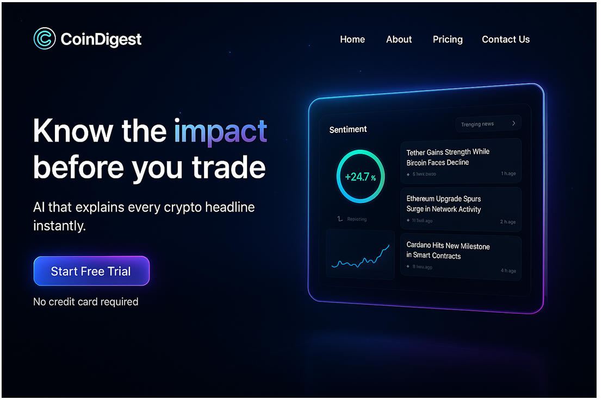
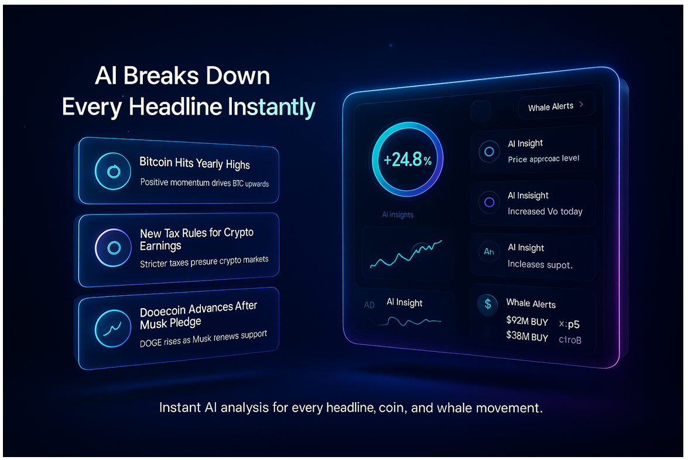
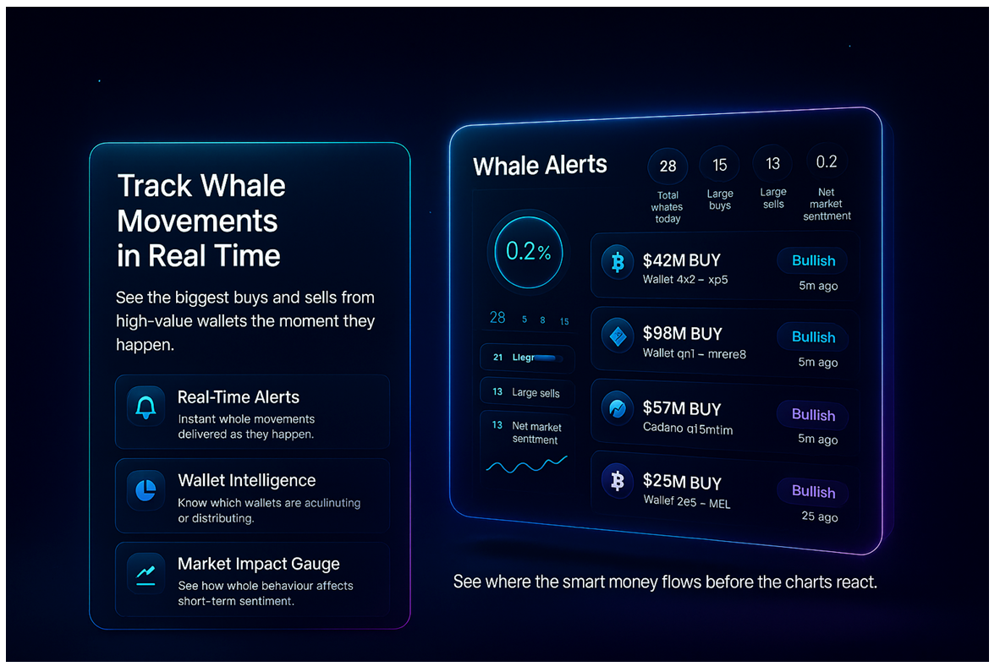
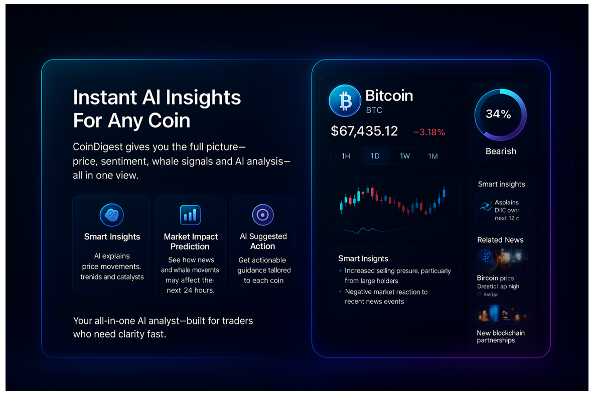
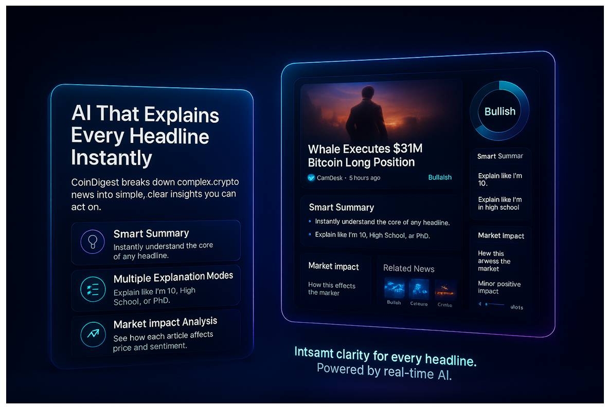
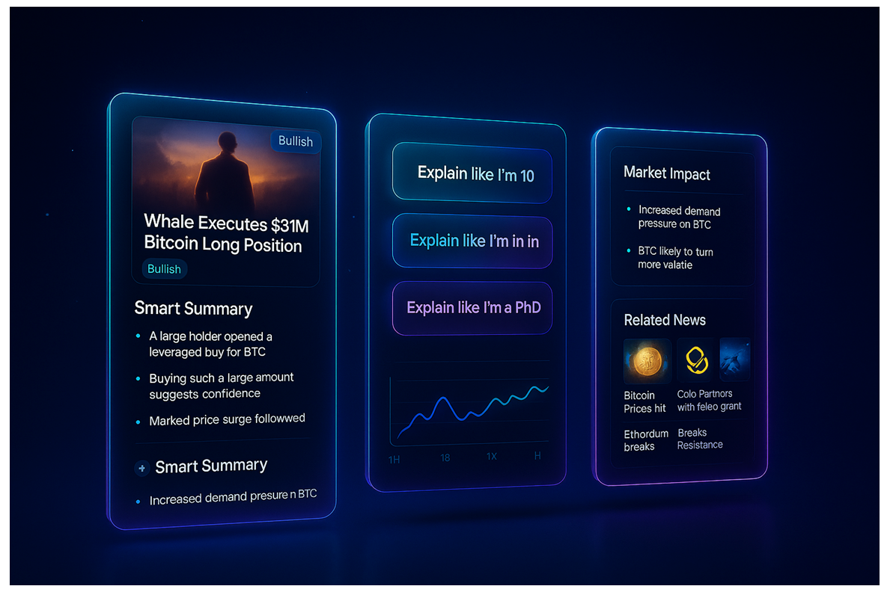
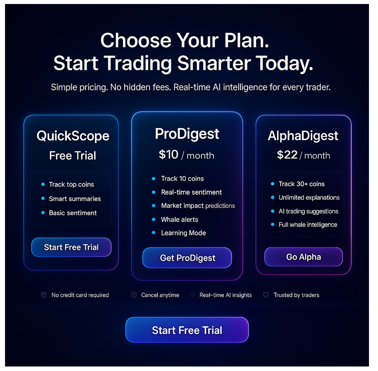

# 🚀 Landing Page

## ✨ Hero Section

This is the first page users see when they visit CoinDigest. The purpose of this page is to introduce the platform, show the main value, and push users toward the free trial.

### 📐 Layout Notes

- ⬅️ Left side contains the headline, sub-headline, and CTA button.
- ➡️ Right side contains a floating glassmorphic preview panel that shows:
  - 📊 Sentiment gauge
  - 📰 Trending crypto headlines
  - 📈 Small price chart
- The background is a deep navy-black gradient with subtle stars and a soft glow around the right panel.
- All elements follow the standard CoinDigest neon Web3 theme: cyan + purple glow, glassmorphic surfaces.

### 📝 Text on Screen

**Headline:**
> 💡 Know the impact before you trade

**Sub-headline:**
> 🤖 AI that explains every crypto headline instantly.

**CTA Button:**
> 🎯 Start Free Trial

**Small Note:**
> ✅ No credit card required

### 🎨 Right Panel Content

- 🔵 A circular sentiment gauge showing the current market sentiment.
- 📋 A vertical list of 3 trending headlines with timestamps.
- 📊 A small price trend chart at the bottom.
- ✨ Panel border glows with neon cyan and purple, matching the CoinDigest theme.

### General Style Notes

- Everything uses Inter font, clean and modern.
- Keep spacing similar to the reference image.
- Ensure the right panel floats slightly and has a soft glass blur.
- No green anywhere unless it is part of sentiment or chart data.
- Maintain a premium, minimal, Web3 aesthetic throughout.

---

## 📊 Sentiment Section

This section explains the Sentiment feature. Use the same colours and style as the hero section: dark navy background, glowing blue and purple edges, glass/blur effects.

For this section specifically, the sentiment colours must be:
- 🟢 **Green** for Bullish
- 🔴 **Red** for Bearish
- ⚪ **Grey or light blue** for Neutral

### Text That Must Appear on Screen

**Title:**
> Understand Market Sentiment Before You Trade

**Sub-text:**
> CoinDigest tracks sentiment in real time across thousands of crypto headlines.

**Feature Box 1:**
- **Title:** 🎯 Spot Sentiment
- **Description:** See instant shifts in bullish, neutral, and bearish pressure.

**Feature Box 2:**
- **Title:** 🔍 Sentiment Breakdown
- **Description:** See exactly which headlines influence market sentiment and why.

**Footer Sentence:**
> Real time sentiment. Real AI insights. Real confidence in every trade.

### Elements the UI Must Include

- A circular sentiment gauge showing green (Bullish) and red (Bearish)
- Three horizontal bars showing Bullish, Neutral, Bearish percentages
- Two buttons: "Why It's Bullish" and "Why It's Bearish"
- Three news headline cards with green or red tags depending on sentiment
- All panels must use the same glass effect and glowing edges as the other sections

---

## 🐋 Whale Alerts Section

This is the second section of the CoinDigest landing page. Its purpose is to explain the Whale Alerts feature and show a live-style preview of the whale activity panel.

### Layout Notes

- Left column: Text explaining the Whale Alerts feature (headline, description, and 3 feature cards).
- Right column: Glassmorphic Whale Alerts preview panel showing sample whale transactions.
- Both columns must follow the CoinDigest neon cyan + purple glow theme.
- Background remains deep navy-black with soft lighting.

### Left Column Content

**Headline:**
> Track Whale Movements in Real Time

**Sub-text:**
> See the biggest buys and sells from high-value wallets the moment they happen.

**Feature Cards (3 items):**

1. **⚡ Real-Time Alerts**
   - Instant whale movements delivered immediately.

2. **🧠 Wallet Intelligence**
   - Know which wallets are accumulating or distributing.

3. **📈 Market Impact Gauge**
   - See how whale behaviour affects short-term sentiment.

### Right Panel Content

Glassmorphic Whale Alerts Preview showing:
- Circular sentiment/flow gauge
- Metrics row:
  - Total whales today
  - Large buys
  - Large sells
  - Net market sentiment
- List of sample whale buy alerts:
  - 💰 $42M BUY (Bitcoin)
  - 💰 $98M BUY (Ethereum)
  - 💰 $57M BUY (Cardano)
  - 💰 $25M BUY (Bitcoin)

Each alert shows:
- Coin icon
- Amount
- Wallet reference
- Timestamp
- Sentiment tag (Bullish)

**Bottom Text:**
> See where the smart money flows before the charts react.

### Colors

- **Background:** `#030B1A` to `#081020` gradient
- **Panel borders:** Neon Cyan (`#38F8FF`) + Neon Purple (`#A855FF`) blend
- **Text:** White (`#FFFFFF`)
- **Subtext:** Light Gray (`#B8C2CC`)
- **Sentiment tags:**
  - Bullish: Cyan (`#00E5FF`)
- **Icons:** Follow official coin brand colors

### Font

- **Font family:** Inter
- **Heading weight:** 700
- **Body weight:** 400–500
- **Headline size:** 42–48px
- **Subtext:** 18–20px
- **Feature card titles:** 20px
- **Whale list text:** 18–20px
- **Sentiment tags:** 16px

### Border & Effects

- All panels use glassmorphic blur (12–20px blur)
- Transparent dark layer (`rgba(255, 255, 255, 0.05)`)
- Outer neon rim glow (cyan + purple)
- Rounded corners (16–22px depending on panel)

### Animations

- Panels fade in from 0% to 100% with slight upward motion
- Neon border glows from cyan → aqua → purple on load
- Whale alert items slide upward individually (stagger 0.08s)
- Hover effect on feature cards:
  - Slight scale-up (1.02x)
  - Border glow intensifies
- Whale alert row hover:
  - Icon brightens
  - Sentiment tag pulses softly

### Developer Notes

- Ensure spacing between cards is consistent
- Keep the right preview panel width similar to the reference
- Make the left headline large and readable for marketing clarity
- Optimize layout for desktop first

---

## 💎 Coin Insights Section

Background must be dark navy with soft neon cyan and purple lighting. All boxes, panels, and charts use glass blur, rounded edges, and glowing outlines. Left side contains the main text and three feature tiles. Right side shows the full Coin Insights panel with price, chart, sentiment ring, smart insights and related news.

### Text to Display on Screen

**Main heading:**
> Instant AI Insights For Any Coin

**Sub heading:**
> CoinDigest gives you the full picture price, sentiment, whale signals and AI analysis all in one view.

**Feature tile one:**
- **Title:** 🧠 Smart Insights
- **Text:** AI explains price movements, trends and catalysts

**Feature tile two:**
- **Title:** 🔮 Market Impact Prediction
- **Text:** See how news and whale movements may affect the next 24 hours

**Feature tile three:**
- **Title:** 🎯 AI Suggested Action
- **Text:** Get actionable guidance tailored to each coin

**Bottom text:**
> Your all in one AI analyst built for traders who need clarity fast.

### Right Panel Must Include

- Coin name
- Coin logo
- Price
- Percent change in red
- Timeframe buttons: 1H, 1D, 1W, 1M
- Candlestick chart
- Smart insights list
- Related News module
- Sentiment ring with Bearish label

---

## 🤖 AI Headline Explanation Section

**Section Title:**
> AI That Explains Every Headline Instantly

### Purpose

This section shows users that CoinDigest can instantly break down any crypto headline into simple explanations, sentiment, impact, and related information. It teaches users that the platform gives fast clarity on every article.

### Layout

Two main panels side by side.

### Left Panel

Large title and short description explaining that CoinDigest simplifies complex crypto news. Under the text, there are three feature cards.

**Feature Cards:**

**Card 1:**
- **Title:** 📝 Smart Summary
- **Description:** Instantly understand the core of any headline.

**Card 2:**
- **Title:** 🎓 Multiple Explanation Modes
- **Description:**
  - 👶 Explain like I am 10
  - 👤 Explain normally
  - 🎓 Explain like I am an expert

**Card 3:**
- **Title:** 📊 Market Impact Analysis
- **Description:** See how each article affects price and sentiment.

### Right Panel

A floating glassmorphic panel based on the first reference image but using the premium button styling from the second reference image. This panel shows a preview of the AI explanation system.

**Right Panel Elements:**

1. Headline card with featured image.
2. Sentiment gauge on the right side.
   - Bullish must be neon green.
   - Bearish must be neon red.
3. Smart Summary section under the headline.
4. The three explanation mode buttons displayed vertically using the premium style from the second reference image.
   - Button 1: Explain like I am 10
   - Button 2: Explain normally
   - Button 3: Explain like I am an expert
5. Market impact section below the buttons.
6. Related news thumbnails under the market impact section.

### Colors

Use the official CoinDigest theme.

- **Background:** Deep navy black
- **All panels:** Glassmorphic with cyan and soft purple rim light
- **Buttons:** Floating glass style with cyan to purple gradient glow

### Animations

- Panels fade in softly as user scrolls.
- Buttons have a gentle hover glow.
- Sentiment gauge should animate from zero to its percentage when visible.

### Font

- Use Inter for all text.
- **Weights:**
  - Title: 700
  - Subheadings: 600
  - Body: 400 to 500

---
## 🚀 AI Explainer Engine – Detailed Feature Breakdown

This section shows the deeper parts of the AI Explainer Engine. Use the same dark navy background with glowing blue and purple glass panels.

### Text on the Cards

Text on the cards must appear exactly like this:

**CARD 1 – Article and Smart Summary**

- **Headline:** Whale Executes 31M Bitcoin Long Position
- **Sentiment Tag:** Bullish
- **Smart Summary bullets:**
  - A large holder opened a leveraged buy for BTC
  - Buying such a large amount suggests confidence
  - Marked price surge followed
- **Extra Smart Summary line:**
  - Increased demand pressure on BTC

**CARD 2 – Learning Modes and Mini Chart**

- **Buttons:**
  - Explain like I'm 10
  - Explain like I'm in high school
  - Explain like I'm a PhD
- Include the small line chart under the buttons.

**CARD 3 – Market Impact and Related News**

- **Market Impact bullets:**
  - Increased demand pressure on BTC
  - BTC likely to turn more volatile
- **Related News (show thumbnails and titles):**
  - Bitcoin Prices Hit
  - Colo Partners With Feleo Grant
  - Etherdurn Breaks Resistance

### Overall Layout

Three tall glass panels displayed side by side. Neon edges, soft glow, clean typography, and no green anywhere. Everything must look premium and match the CoinDigest style. 

---
## 💰 Pricing Section

**Section Title:**
> Choose Your Plan  
> Start Trading Smarter Today.

**Subtext:**
> Simple pricing. No hidden fees. Real time AI intelligence for every trader.

### Purpose

This section shows all CoinDigest membership tiers. Each card must display the correct features from the official membership document. Users should clearly understand the differences between QuickScope, ProDigest, and AlphaDigest.

### Layout

Three glassmorphic price cards displayed side by side. Each card has a soft neon cyan and purple rim light. Each card has its own CTA button under the feature list.

### Font

- Inter for all text.
- **Titles:** 700
- **Feature list:** 500
- **Body text:** 400

### Color Style

- **Background:** Deep navy black
- **Cards:** Glassmorphic with cyan and soft purple edges
- **Buttons:** Cyan to purple gradient, glowing softly
- **Icons:** Cyan accents

### Animations

- Cards rise slightly on hover.
- Buttons glow gently when hovered.
- Feature bullets fade in when scrolled into view.

### Pricing Cards

**Card 1:**
- **Title:** 🎯 QuickScope
- **Price:** 💸 Free Trial
- **Features:**
  - 📊 Track top coins
  - 📝 Smart summaries
  - 📈 Basic sentiment
- **CTA Button:** 🚀 Start Free Trial

**Card 2:**
- **Title:** ⭐ ProDigest
- **Price:** 💵 Ten dollars per month
- **Features:**
  - 📊 Track ten coins
  - ⚡ Real time sentiment
  - 🔮 Market impact predictions
  - 🐋 Whale alerts
  - 🎓 Learning Mode
- **CTA Button:** ✨ Get ProDigest

**Card 3:**
- **Title:** 👑 AlphaDigest
- **Price:** 💎 Twenty two dollars per month
- **Features:**
  - 📊 Track thirty coins
  - ♾️ Unlimited explanations
  - 🤖 AI trading suggestions
  - 🐋 Full whale intelligence
- **CTA Button:** 🚀 Go Alpha

### Footer Icon Row

- ✅ No credit card required
- 🔄 Cancel anytime
- ⚡ Real time AI insights
- 🌟 Trusted by traders

---

## 🔗 Footer Section

### Section Purpose

This is the final call to action and the full website footer. It encourages users to start their free trial and then shows platform links, legal pages, and the brand description.

### Design Style

- Glassmorphic panel with soft cyan and purple rim light.
- Deep navy black background.
- All text uses Inter font.
- Cards/icons use neon cyan accents.
- Buttons use cyan to purple gradient with soft glow.

### Layout

- **Top area:** CTA block
- **Middle area:** Four feature highlight cards
- **Bottom area:** Footer navigation (three columns)

### Animations

- CTA box fades upward when scrolled into view.
- Feature cards glow softly on hover.
- Footer links slide up 2px on hover.
- CTA button glows on hover.

### Top CTA Block

**Title:**
> Start Making Smarter Crypto Decisions Today

**Subtitle:**
> Join traders who use AI powered insights to stay ahead of the market.

### Feature Cards (4 total)

1. ⚡ Real time AI analysis
2. 🌍 Trusted by traders worldwide
3. 🔒 Secure Web3 grade infrastructure
4. ✅ No credit card required

**CTA Button:**
> Start Free Trial

### Footer Navigation

**Column 1 - Brand:**
- **CoinDigest**
- AI powered crypto insights, sentiment, and intelligence in one place.

**Column 2 - Platform:**
- How It Works
- Pricing
- Features

**Column 3 - Legal:**
- Terms of Service
- Privacy Policy
- Data Usage

### Notes / Fixes

- Fix all typos from the AI image
- "Truszed" should be "Trusted"
- "Web83 grade" should be "Web3 grade"
- Ensure spacing is consistent between columns
- Footer background should be darker than the CTA block for separation
- Do not copy any odd wording from the AI image
- Use clean, correct English only
